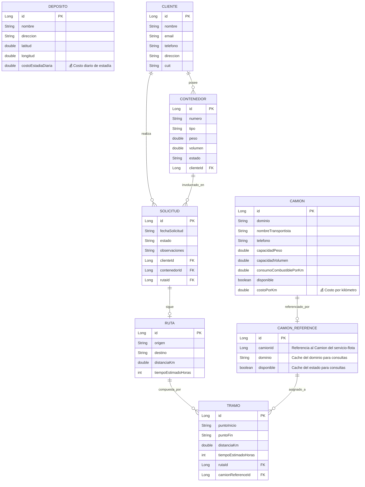

# Diagrama Entidad-Relación (DER) - Sistema de Transporte Optimizado

## Descripción del Modelo Optimizado

Este DER representa el modelo de negocio optimizado donde:
- **Los costos están integrados directamente en las entidades** (eliminamos la entidad genérica Tarifa)
- **Camion** maneja `costoPorKm` para costos de transporte
- **Deposito** maneja `costoEstadiaDiaria` para costos de almacenamiento
- **Microservicios separados** con referencias cruzadas seguras

## Código Mermaid para el DER

## Explicación de las Entidades

### SERVICIO-FLOTA

#### CAMION
- **Propósito**: Gestiona la flota de vehículos de transporte
- **Campo clave**: `costoPorKm` - Permite calcular costos de transporte directamente
- **Capacidades**: Peso, volumen, consumo de combustible
- **Estado**: Disponible/ocupado para asignaciones

#### DEPOSITO  
- **Propósito**: Gestiona las instalaciones de almacenamiento
- **Campo clave**: `costoEstadiaDiaria` - Permite calcular costos de almacenamiento
- **Ubicación**: Coordenadas GPS para geolocalización
- **Capacidades**: Almacenamiento temporal de contenedores

### SERVICIO-OPERACIONES

#### CLIENTE
- **Propósito**: Información de clientes que solicitan servicios
- **Datos**: Contacto, facturación (CUIT), dirección

#### CONTENEDOR
- **Propósito**: Unidades de carga a transportar
- **Propietario**: Pertenece a un cliente específico
- **Características**: Tipo, peso, volumen, estado

#### SOLICITUD
- **Propósito**: Pedidos de transporte realizados por clientes
- **Componentes**: Cliente, contenedor específico, ruta planificada
- **Estados**: Pendiente, en proceso, completada, cancelada

#### RUTA
- **Propósito**: Caminos planificados entre origen y destino
- **Métricas**: Distancia total, tiempo estimado

#### TRAMO
- **Propósito**: Segmentos individuales de una ruta
- **Asignación**: Cada tramo se asigna a un camión específico
- **Flexibilidad**: Permite rutas multi-etapa con diferentes vehículos

#### CAMION_REFERENCE
- **Propósito**: Referencia segura entre microservicios
- **Cache**: Mantiene información básica para consultas rápidas
- **Sincronización**: Se actualiza cuando cambia el estado del camión

## Ventajas del Modelo Optimizado

### 🎯 **Eliminación de Complejidad**
- **Antes**: Sistema genérico de tarifas difícil de mantener
- **Ahora**: Costos específicos integrados en cada entidad

### 💰 **Gestión de Costos Simplificada**
- **Camión**: `costoPorKm` para transporte
- **Depósito**: `costoEstadiaDiaria` para almacenamiento
- **Cálculo directo**: Sin consultas adicionales a tablas de tarifas

### 🔄 **Mejor Separación de Responsabilidades**
- **servicio-flota**: Gestión pura de recursos físicos
- **servicio-operaciones**: Gestión pura de procesos de negocio
- **Referencias controladas**: Comunicación segura entre servicios

### 📈 **Escalabilidad**
- **Costos flexibles**: Cada entidad maneja sus propios costos
- **Fácil mantenimiento**: Cambios de precios sin reestructurar BD
- **Performance**: Menos joins en consultas de costos

## Reglas de Negocio Implementadas

1. **Un cliente puede tener múltiples contenedores**
2. **Un cliente puede realizar múltiples solicitudes**
3. **Cada solicitud involucra un contenedor específico**
4. **Cada solicitud sigue una ruta planificada**
5. **Una ruta se divide en tramos operativos**
6. **Cada tramo se asigna a un camión disponible**
7. **Los costos se calculan directamente desde las entidades**

---

*DER generado para el proyecto TPI-Integrador - Backend de Sistema de Transporte*
*Última actualización: Modelo optimizado sin entidad Tarifa*