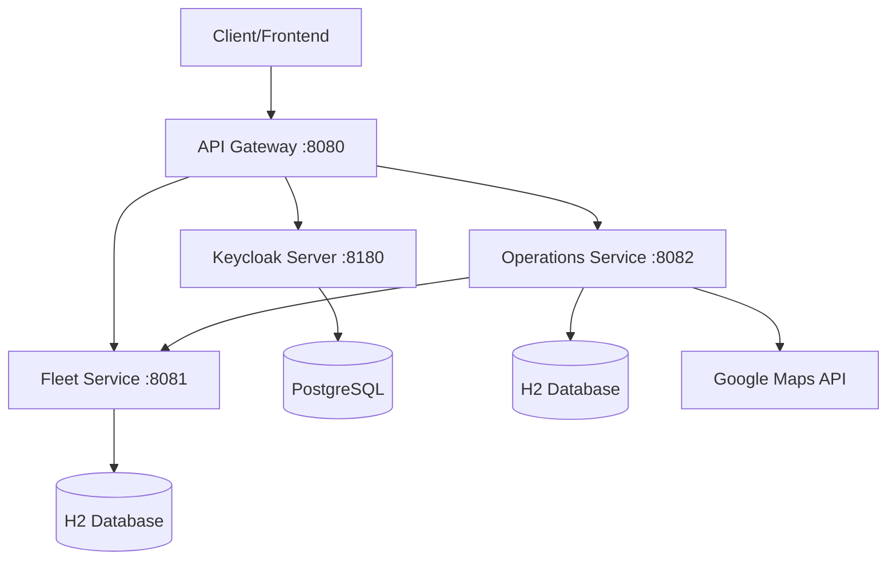
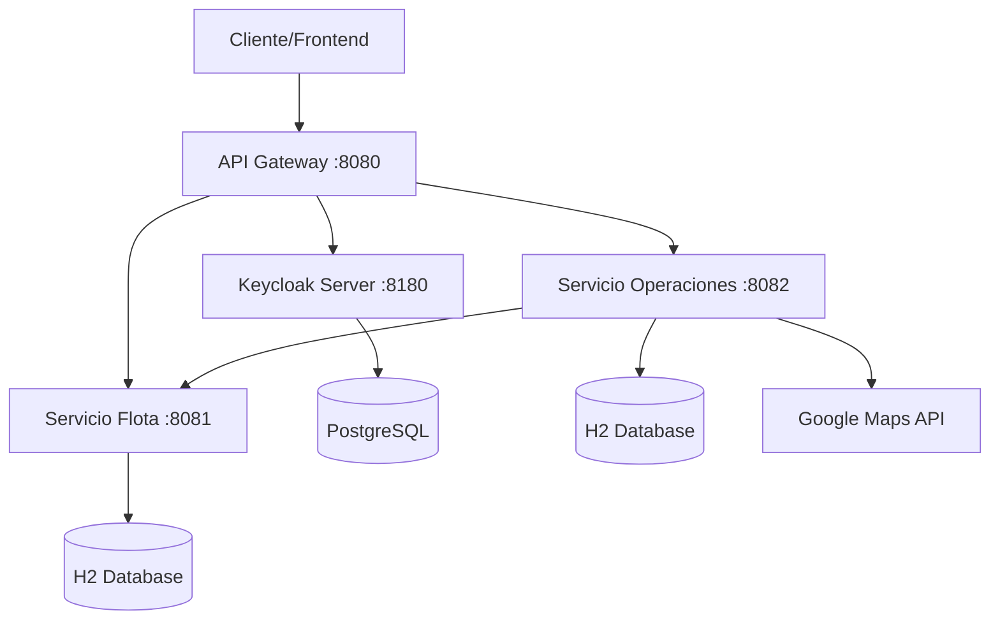

# 🚚 TPI Backend - Fleet and Operations Management System

[🇪🇸 Español](#español) | 🇺🇸 **English**

## 📋 Project Description

Backend microservices system developed with **Spring Boot** that implements a complete architecture for truck fleet management and logistics operations. Includes **API Gateway**, **OAuth2/JWT authentication** with Keycloak, and independent services for fleet and operations management.

## 🏗️ Microservices Architecture



## 🚀 Features

### 🔐 Security
- **OAuth2 + JWT** with Keycloak
- **Protected endpoints** with Bearer tokens
- **Circuit Breaker** for fault tolerance
- **CORS configured** for development

### 📊 Services
- **API Gateway**: Centralized routing and load balancing
- **Fleet Service**: Truck, depot and rate management  
- **Operations Service**: Client, container and request handling
- **Real-time tracking** with Google Maps
- **Inter-service integration** with OpenFeign

### 🛠️ Technologies
- **Spring Boot 3.5.6** + **Spring Cloud Gateway**
- **Spring Security 6** + **OAuth2 Resource Server**
- **Spring Data JPA** + **Hibernate**
- **H2 Database** (development) + **PostgreSQL** (Keycloak)
- **Docker & Docker Compose**
- **OpenAPI 3** + **Swagger UI**
- **Maven Wrapper** included

## ⚙️ Initial Setup

### 1️⃣ Prerequisites
```bash
# Java 21+ installed
java -version

# Docker installed and running
docker --version

# Git to clone the repository
git --version
```

### 2️⃣ Clone and Configure
```bash
# Clone the repository
git clone https://github.com/EliasKarimRaueh/TPI-Backend.git
cd TPI-Backend

# Configure Google Maps API Key
cp servicio-operaciones/src/main/resources/application.properties.example \
   servicio-operaciones/src/main/resources/application.properties

# Edit application.properties with your API Key
# google.maps.api-key=YOUR_API_KEY_HERE
```

### 3️⃣ Keycloak Setup
```bash
# Start Keycloak with Docker
cd docker
docker-compose -f docker-compose-keycloak.yml up -d

# Access Keycloak Admin Console
# URL: http://localhost:8180
# User: admin / Pass: admin123

# The 'tpi-backend' realm is configured automatically
```

## 🚀 Installation and Execution

### Option 1: Automated Scripts
```bash
# Start all services
./scripts/start-all-services.sh

# Or individual
./scripts/start-keycloak-only.sh
```

### Option 2: Manual (Recommended for development)

**Terminal 1 - Keycloak:**
```bash
cd docker
docker-compose -f docker-compose-keycloak.yml up
```

**Terminal 2 - Fleet Service:**
```bash
cd servicio-flota
./mvnw.cmd spring-boot:run
```

**Terminal 3 - Operations Service:**
```bash
cd servicio-operaciones
./mvnw.cmd spring-boot:run
```

**Terminal 4 - API Gateway:**
```bash
cd api-gateway
./mvnw.cmd spring-boot:run
```

## 🔌 Ports and Endpoints

| Service | Port | Base URL | Documentation |
|---------|------|----------|---------------|
| **API Gateway** | 8080 | `http://localhost:8080` | `/actuator/health` |
| **Keycloak** | 8180 | `http://localhost:8180` | `/admin` |
| **Fleet Service** | 8081 | `http://localhost:8081` | `/swagger-ui.html` |
| **Operations Service** | 8082 | `http://localhost:8082` | `/swagger-ui.html` |

### 🛣️ API Gateway Routes

#### Fleet
- `GET /api/flota/camiones` - Truck list
- `GET /api/flota/depositos` - Depot list  
- `GET /api/flota/tarifas` - Current rates

#### Operations  
- `GET /api/operaciones/clientes` - Client list
- `POST /api/operaciones/solicitudes` - New request
- `GET /api/operaciones/seguimiento/{id}` - Real-time tracking

## 🔐 Authentication

### Get JWT Token
```bash
curl -X POST http://localhost:8180/realms/tpi-backend/protocol/openid-connect/token \
  -H "Content-Type: application/x-www-form-urlencoded" \
  -d "client_id=postman-client" \
  -d "username=testuser" \
  -d "password=test123" \
  -d "grant_type=password"
```

### Use Token in Requests
```bash
curl -H "Authorization: Bearer YOUR_JWT_TOKEN" \
     http://localhost:8080/api/flota/camiones
```

## 🧪 Testing

### Complete E2E Testing
```bash
# Run complete test suite
./test-e2e-microservicios.ps1
```

### Individual Testing
```bash
# Authentication test
./scripts/test-authentication.sh

# Endpoints test
./scripts/test-endpoints-security.sh

# Quick manual test
./scripts/test-manual-quick.sh
```

## 📁 Project Structure

```
tpi-Integrador/
├── api-gateway/                 # 🌐 Spring Cloud Gateway
│   ├── src/main/java/com/tpi/gateway/
│   │   ├── config/             # OAuth2 and CORS configuration
│   │   ├── controller/         # OpenAPI aggregation
│   │   └── filter/             # Custom filters
│   └── src/main/resources/
│       └── application.yml     # Routes configuration
├── servicio-flota/             # 🚛 Fleet Management
│   ├── src/main/java/utn/frc/isi/backend/tpi_Integrador/
│   │   ├── controllers/        # REST API Controllers
│   │   ├── models/             # JPA Entities
│   │   ├── services/           # Business logic
│   │   └── config/             # Security configuration
│   └── src/main/resources/
│       ├── application.properties
│       └── data.sql           # Test data
├── servicio-operaciones/       # 📦 Operations Management  
│   ├── src/main/java/utn/frc/isi/backend/tpi_Integrador/
│   │   ├── controllers/        # REST API Controllers
│   │   ├── models/             # JPA Entities
│   │   ├── services/           # Business logic
│   │   ├── clients/            # Feign clients
│   │   └── config/             # Security configuration
│   └── src/main/resources/
│       ├── application.properties.example
│       └── data.sql           # Test data
├── docker/                     # 🐳 Containers
│   ├── docker-compose-keycloak.yml
│   └── keycloak/
│       └── realm-config.json  # Realm configuration
├── scripts/                    # 🔧 Automation
│   ├── start-all-services.sh
│   ├── test-authentication.sh
│   └── configure-keycloak.sh
├── test-e2e-microservicios.ps1 # 🧪 E2E Testing
└── README.md                   # 📖 This documentation
```

## 🔒 Security and Configuration

### Required Environment Variables
```bash
# Google Maps API Key (REQUIRED)
GOOGLE_MAPS_API_KEY=your_api_key_here

# OAuth2 Configuration (Optional - uses defaults)
KEYCLOAK_URL=http://localhost:8180
OAUTH2_CLIENT_ID=postman-client
```

### Files NOT included in Git
```
servicio-operaciones/src/main/resources/application.properties  # API Keys
**/.mvn/wrapper/maven-wrapper.jar                              # Binaries
**/target/                                                      # Builds
```

## 📊 Main Features

### 🚛 Fleet Management
- **Truck CRUD**: Capacity, consumption, availability
- **Depot Management**: Geographic locations  
- **Dynamic Rates**: Date-based pricing system
- **H2 Database**: In-memory data for development

### 📦 Operations Management
- **Client CRUD**: Complete commercial information
- **Transport Requests**: Complete workflow
- **GPS Tracking**: Google Maps integration
- **Containers**: State and location management
- **Fleet Communication**: Integrated Feign client

### 🔐 Advanced Security
- **JWT Tokens**: Distributed validation
- **Resource Server**: Each microservice validates tokens
- **Circuit Breaker**: Fault resilience
- **Rate Limiting**: Traffic control (configurable)

## 🐛 Troubleshooting

### Common Issues

**Error: Port 8080 occupied**
```bash
# Check which process uses the port
netstat -ano | findstr :8080
# Change port in application.yml if necessary
```

**Error: Keycloak not responding**
```bash
# Check container status
docker ps | grep keycloak
docker logs tpi-keycloak
```

**Error: Google Maps API**
```bash
# Verify API Key configured
grep "google.maps.api-key" servicio-operaciones/src/main/resources/application.properties
```

**Error: Maven wrapper**
```bash
# Give execution permissions (Linux/Mac)
chmod +x mvnw
# Windows: use mvnw.cmd
```

## 📈 Monitoring and Observability

### Health Checks
```bash
# API Gateway
curl http://localhost:8080/actuator/health

# Individual services  
curl http://localhost:8081/actuator/health
curl http://localhost:8082/actuator/health
```

### Metrics
- **Actuator endpoints** enabled
- **Structured logs** with correlation
- **Circuit breaker metrics** available

## 🛠️ Development and Contribution

### Add New Endpoint
1. Create controller in corresponding microservice
2. Add route in `api-gateway/application.yml`
3. Document in OpenAPI
4. Add tests in `test-e2e-microservicios.ps1`

### Commit Structure
```
feat: new functionality
fix: bug fixes  
docs: documentation
refactor: code refactoring
test: add tests
```

## 📞 Contact and Support

- **Developer**: Elias Karim Raueh
- **University**: UTN Regional Faculty Córdoba
- **Subject**: Backend Applications
- **Repository**: [TPI-Backend](https://github.com/EliasKarimRaueh/TPI-Backend)

---

## 🎓 National Technological University - Regional Faculty Córdoba

**Backend Applications - TPI Backend 2025**

---

# Español

🇪🇸 **Español** | [🇺🇸 English](#-tpi-backend---fleet-and-operations-management-system)

# 🚚 TPI Backend - Sistema de Gestión de Flota y Operaciones

## 📋 Descripción del Proyecto

Sistema de microservicios backend desarrollado con **Spring Boot** que implementa una arquitectura completa para gestión de flota de camiones y operaciones logísticas. Incluye **API Gateway**, **autenticación OAuth2/JWT** con Keycloak, y servicios independientes para manejo de flota y operaciones.

## 🏗️ Arquitectura de Microservicios



## 🚀 Características

### 🔐 Seguridad
- **OAuth2 + JWT** con Keycloak
- **Endpoints protegidos** con tokens Bearer
- **Circuit Breaker** para tolerancia a fallos
- **CORS configurado** para desarrollo

### 📊 Servicios
- **API Gateway**: Enrutamiento centralizado y balanceeo
- **Servicio Flota**: Gestión de camiones, depósitos y tarifas  
- **Servicio Operaciones**: Manejo de clientes, contenedores y solicitudes
- **Seguimiento en tiempo real** con Google Maps
- **Integración entre servicios** con OpenFeign

### 🛠️ Tecnologías
- **Spring Boot 3.5.6** + **Spring Cloud Gateway**
- **Spring Security 6** + **OAuth2 Resource Server**
- **Spring Data JPA** + **Hibernate**
- **H2 Database** (desarrollo) + **PostgreSQL** (Keycloak)
- **Docker & Docker Compose**
- **OpenAPI 3** + **Swagger UI**
- **Maven Wrapper** incluido

## ⚙️ Configuración Inicial

### 1️⃣ Prerequisitos
```bash
# Java 21+ instalado
java -version

# Docker instalado y corriendo
docker --version

# Git para clonar el repositorio
git --version
```

### 2️⃣ Clonar y Configurar
```bash
# Clonar el repositorio
git clone https://github.com/EliasKarimRaueh/TPI-Backend.git
cd TPI-Backend

# Configurar API Key de Google Maps
cp servicio-operaciones/src/main/resources/application.properties.example \
   servicio-operaciones/src/main/resources/application.properties

# Editar application.properties con tu API Key
# google.maps.api-key=TU_API_KEY_AQUI
```

### 3️⃣ Keycloak Setup
```bash
# Iniciar Keycloak con Docker
cd docker
docker-compose -f docker-compose-keycloak.yml up -d

# Acceder a Keycloak Admin Console
# URL: http://localhost:8180
# User: admin / Pass: admin123

# El realm 'tpi-backend' se configura automáticamente
```

## 🚀 Instalación y Ejecución

### Opción 1: Scripts Automatizados
```bash
# Iniciar todos los servicios
./scripts/start-all-services.sh

# O individual
./scripts/start-keycloak-only.sh
```

### Opción 2: Manual (Recomendado para desarrollo)

**Terminal 1 - Keycloak:**
```bash
cd docker
docker-compose -f docker-compose-keycloak.yml up
```

**Terminal 2 - Servicio Flota:**
```bash
cd servicio-flota
./mvnw.cmd spring-boot:run
```

**Terminal 3 - Servicio Operaciones:**
```bash
cd servicio-operaciones
./mvnw.cmd spring-boot:run
```

**Terminal 4 - API Gateway:**
```bash
cd api-gateway
./mvnw.cmd spring-boot:run
```

## 🔌 Puertos y Endpoints

| Servicio | Puerto | URL Base | Documentación |
|----------|--------|----------|---------------|
| **API Gateway** | 8080 | `http://localhost:8080` | `/actuator/health` |
| **Keycloak** | 8180 | `http://localhost:8180` | `/admin` |
| **Servicio Flota** | 8081 | `http://localhost:8081` | `/swagger-ui.html` |
| **Servicio Operaciones** | 8082 | `http://localhost:8082` | `/swagger-ui.html` |

### 🛣️ Rutas del API Gateway

#### Flota
- `GET /api/flota/camiones` - Lista de camiones
- `GET /api/flota/depositos` - Lista de depósitos  
- `GET /api/flota/tarifas` - Tarifas vigentes

#### Operaciones  
- `GET /api/operaciones/clientes` - Lista de clientes
- `POST /api/operaciones/solicitudes` - Nueva solicitud
- `GET /api/operaciones/seguimiento/{id}` - Tracking en tiempo real

## 🔐 Autenticación

### Obtener Token JWT
```bash
curl -X POST http://localhost:8180/realms/tpi-backend/protocol/openid-connect/token \
  -H "Content-Type: application/x-www-form-urlencoded" \
  -d "client_id=postman-client" \
  -d "username=testuser" \
  -d "password=test123" \
  -d "grant_type=password"
```

### Usar Token en Requests
```bash
curl -H "Authorization: Bearer YOUR_JWT_TOKEN" \
     http://localhost:8080/api/flota/camiones
```

## 🧪 Testing

### Testing E2E Completo
```bash
# Ejecutar suite completa de pruebas
./test-e2e-microservicios.ps1
```

### Testing Individual
```bash
# Test de autenticación
./scripts/test-authentication.sh

# Test de endpoints
./scripts/test-endpoints-security.sh

# Test manual rápido
./scripts/test-manual-quick.sh
```

## 📁 Estructura del Proyecto

```
tpi-Integrador/
├── api-gateway/                 # 🌐 Spring Cloud Gateway
│   ├── src/main/java/com/tpi/gateway/
│   │   ├── config/             # Configuración OAuth2 y CORS
│   │   ├── controller/         # Agregación OpenAPI
│   │   └── filter/             # Filtros personalizados
│   └── src/main/resources/
│       └── application.yml     # Configuración rutas
├── servicio-flota/             # 🚛 Gestión de Flota
│   ├── src/main/java/utn/frc/isi/backend/tpi_Integrador/
│   │   ├── controllers/        # API REST Controllers
│   │   ├── models/             # Entidades JPA
│   │   ├── services/           # Lógica de negocio
│   │   └── config/             # Configuración seguridad
│   └── src/main/resources/
│       ├── application.properties
│       └── data.sql           # Datos de prueba
├── servicio-operaciones/       # 📦 Gestión de Operaciones  
│   ├── src/main/java/utn/frc/isi/backend/tpi_Integrador/
│   │   ├── controllers/        # API REST Controllers
│   │   ├── models/             # Entidades JPA
│   │   ├── services/           # Lógica de negocio
│   │   ├── clients/            # Feign clients
│   │   └── config/             # Configuración seguridad
│   └── src/main/resources/
│       ├── application.properties.example
│       └── data.sql           # Datos de prueba
├── docker/                     # 🐳 Contenedores
│   ├── docker-compose-keycloak.yml
│   └── keycloak/
│       └── realm-config.json  # Configuración realm
├── scripts/                    # 🔧 Automatización
│   ├── start-all-services.sh
│   ├── test-authentication.sh
│   └── configure-keycloak.sh
├── test-e2e-microservicios.ps1 # 🧪 Testing E2E
└── README.md                   # 📖 Esta documentación
```

## 🔒 Seguridad y Configuración

### Variables de Entorno Requeridas
```bash
# Google Maps API Key (OBLIGATORIO)
GOOGLE_MAPS_API_KEY=tu_api_key_aqui

# OAuth2 Configuration (Opcional - usa defaults)
KEYCLOAK_URL=http://localhost:8180
OAUTH2_CLIENT_ID=postman-client
```

### Archivos NO incluidos en Git
```
servicio-operaciones/src/main/resources/application.properties  # API Keys
**/.mvn/wrapper/maven-wrapper.jar                              # Binarios
**/target/                                                      # Builds
```

## 📊 Funcionalidades Principales

### 🚛 Gestión de Flota
- **CRUD Camiones**: Capacidad, consumo, disponibilidad
- **Gestión Depósitos**: Ubicaciones geográficas  
- **Tarifas Dinámicas**: Sistema de precios por fecha
- **Base de datos H2**: Datos en memoria para desarrollo

### 📦 Gestión de Operaciones
- **CRUD Clientes**: Información comercial completa
- **Solicitudes de Transporte**: Workflow completo
- **Seguimiento GPS**: Integración Google Maps
- **Contenedores**: Gestión de estados y ubicación
- **Comunicación con Flota**: Cliente Feign integrado

### 🔐 Seguridad Avanzada
- **JWT Tokens**: Validación distribuida
- **Resource Server**: Cada microservicio valida tokens
- **Circuit Breaker**: Resilencia ante fallos
- **Rate Limiting**: Control de tráfico (configurable)

## 🐛 Troubleshooting

### Problemas Comunes

**Error: Puerto 8080 ocupado**
```bash
# Verificar qué proceso usa el puerto
netstat -ano | findstr :8080
# Cambiar puerto en application.yml si es necesario
```

**Error: Keycloak no responde**
```bash
# Verificar estado del contenedor
docker ps | grep keycloak
docker logs tpi-keycloak
```

**Error: Google Maps API**
```bash
# Verificar API Key configurada
grep "google.maps.api-key" servicio-operaciones/src/main/resources/application.properties
```

**Error: Maven wrapper**
```bash
# Dar permisos de ejecución (Linux/Mac)
chmod +x mvnw
# Windows: usar mvnw.cmd
```

## 📈 Monitoreo y Observabilidad

### Health Checks
```bash
# API Gateway
curl http://localhost:8080/actuator/health

# Servicios individuales  
curl http://localhost:8081/actuator/health
curl http://localhost:8082/actuator/health
```

### Métricas
- **Actuator endpoints** habilitados
- **Logs estructurados** con correlación
- **Circuit breaker metrics** disponibles

## 🛠️ Desarrollo y Contribución

### Agregar Nuevo Endpoint
1. Crear controller en el microservicio correspondiente
2. Agregar ruta en `api-gateway/application.yml`
3. Documentar en OpenAPI
4. Agregar tests en `test-e2e-microservicios.ps1`

### Estructura de Commits
```
feat: nueva funcionalidad
fix: corrección de bugs  
docs: documentación
refactor: refactoring de código
test: agregar tests
```

## 📞 Contacto y Soporte

- **Desarrollador**: Elias Karim Raueh
- **Universidad**: UTN Facultad Regional Córdoba
- **Materia**: Backend de Aplicaciones
- **Repositorio**: [TPI-Backend](https://github.com/EliasKarimRaueh/TPI-Backend)

---

Sistema de microservicios backend desarrollado con **Spring Boot** que implementa una arquitectura completa para gestión de flota de camiones y operaciones logísticas. Incluye **API Gateway**, **autenticación OAuth2/JWT** con Keycloak, y servicios independientes para manejo de flota y operaciones.

## 🏗️ Arquitectura de Microservicios


## 🚀 Características

### 🔐 Seguridad
- **OAuth2 + JWT** con Keycloak
- **Endpoints protegidos** con tokens Bearer
- **Circuit Breaker** para tolerancia a fallos
- **CORS configurado** para desarrollo

### 📊 Servicios
- **API Gateway**: Enrutamiento centralizado y balanceeo
- **Servicio Flota**: Gestión de camiones, depósitos y tarifas  
- **Servicio Operaciones**: Manejo de clientes, contenedores y solicitudes
- **Seguimiento en tiempo real** con Google Maps
- **Integración entre servicios** con OpenFeign

### 🛠️ Tecnologías
- **Spring Boot 3.5.6** + **Spring Cloud Gateway**
- **Spring Security 6** + **OAuth2 Resource Server**
- **Spring Data JPA** + **Hibernate**
- **H2 Database** (desarrollo) + **PostgreSQL** (Keycloak)
- **Docker & Docker Compose**
- **OpenAPI 3** + **Swagger UI**
- **Maven Wrapper** incluido

## ⚙️ Configuración Inicial

### 1️⃣ Prerequisitos
```bash
# Java 21+ instalado
java -version

# Docker instalado y corriendo
docker --version

# Git para clonar el repositorio
git --version
```

### 2️⃣ Clonar y Configurar
```bash
# Clonar el repositorio
git clone https://github.com/EliasKarimRaueh/TPI-Backend.git
cd TPI-Backend

# Configurar API Key de Google Maps
cp servicio-operaciones/src/main/resources/application.properties.example \
   servicio-operaciones/src/main/resources/application.properties

# Editar application.properties con tu API Key
# google.maps.api-key=TU_API_KEY_AQUI
```

### 3️⃣ Keycloak Setup
```bash
# Iniciar Keycloak con Docker
cd docker
docker-compose -f docker-compose-keycloak.yml up -d

# Acceder a Keycloak Admin Console
# URL: http://localhost:8180
# User: admin / Pass: admin123

# El realm 'tpi-backend' se configura automáticamente
```

## 🚀 Instalación y Ejecución

### Opción 1: Scripts Automatizados
```bash
# Iniciar todos los servicios
./scripts/start-all-services.sh

# O individual
./scripts/start-keycloak-only.sh
```

### Opción 2: Manual (Recomendado para desarrollo)

**Terminal 1 - Keycloak:**
```bash
cd docker
docker-compose -f docker-compose-keycloak.yml up
```

**Terminal 2 - Servicio Flota:**
```bash
cd servicio-flota
./mvnw.cmd spring-boot:run
```

**Terminal 3 - Servicio Operaciones:**
```bash
cd servicio-operaciones
./mvnw.cmd spring-boot:run
```

**Terminal 4 - API Gateway:**
```bash
cd api-gateway
./mvnw.cmd spring-boot:run
```

## 🔌 Puertos y Endpoints

| Servicio | Puerto | URL Base | Documentación |
|----------|--------|----------|---------------|
| **API Gateway** | 8080 | `http://localhost:8080` | `/actuator/health` |
| **Keycloak** | 8180 | `http://localhost:8180` | `/admin` |
| **Servicio Flota** | 8081 | `http://localhost:8081` | `/swagger-ui.html` |
| **Servicio Operaciones** | 8082 | `http://localhost:8082` | `/swagger-ui.html` |

### 🛣️ Rutas del API Gateway

#### Flota
- `GET /api/flota/camiones` - Lista de camiones
- `GET /api/flota/depositos` - Lista de depósitos  
- `GET /api/flota/tarifas` - Tarifas vigentes

#### Operaciones  
- `GET /api/operaciones/clientes` - Lista de clientes
- `POST /api/operaciones/solicitudes` - Nueva solicitud
- `GET /api/operaciones/seguimiento/{id}` - Tracking en tiempo real

## 🔐 Autenticación

### Obtener Token JWT
```bash
curl -X POST http://localhost:8180/realms/tpi-backend/protocol/openid-connect/token \
  -H "Content-Type: application/x-www-form-urlencoded" \
  -d "client_id=postman-client" \
  -d "username=testuser" \
  -d "password=test123" \
  -d "grant_type=password"
```

### Usar Token en Requests
```bash
curl -H "Authorization: Bearer YOUR_JWT_TOKEN" \
     http://localhost:8080/api/flota/camiones
```

## 🧪 Testing

### Testing E2E Completo
```bash
# Ejecutar suite completa de pruebas
./test-e2e-microservicios.ps1
```

### Testing Individual
```bash
# Test de autenticación
./scripts/test-authentication.sh

# Test de endpoints
./scripts/test-endpoints-security.sh

# Test manual rápido
./scripts/test-manual-quick.sh
```

## 📁 Estructura del Proyecto

```
tpi-Integrador/
├── api-gateway/                 # 🌐 Spring Cloud Gateway
│   ├── src/main/java/com/tpi/gateway/
│   │   ├── config/             # Configuración OAuth2 y CORS
│   │   ├── controller/         # Agregación OpenAPI
│   │   └── filter/             # Filtros personalizados
│   └── src/main/resources/
│       └── application.yml     # Configuración rutas
├── servicio-flota/             # 🚛 Gestión de Flota
│   ├── src/main/java/utn/frc/isi/backend/tpi_Integrador/
│   │   ├── controllers/        # API REST Controllers
│   │   ├── models/             # Entidades JPA
│   │   ├── services/           # Lógica de negocio
│   │   └── config/             # Configuración seguridad
│   └── src/main/resources/
│       ├── application.properties
│       └── data.sql           # Datos de prueba
├── servicio-operaciones/       # 📦 Gestión de Operaciones  
│   ├── src/main/java/utn/frc/isi/backend/tpi_Integrador/
│   │   ├── controllers/        # API REST Controllers
│   │   ├── models/             # Entidades JPA
│   │   ├── services/           # Lógica de negocio
│   │   ├── clients/            # Feign clients
│   │   └── config/             # Configuración seguridad
│   └── src/main/resources/
│       ├── application.properties.example
│       └── data.sql           # Datos de prueba
├── docker/                     # 🐳 Contenedores
│   ├── docker-compose-keycloak.yml
│   └── keycloak/
│       └── realm-config.json  # Configuración realm
├── scripts/                    # 🔧 Automatización
│   ├── start-all-services.sh
│   ├── test-authentication.sh
│   └── configure-keycloak.sh
├── test-e2e-microservicios.ps1 # 🧪 Testing E2E
└── README.md                   # 📖 Esta documentación
```

## 🔒 Seguridad y Configuración

### Variables de Entorno Requeridas
```bash
# Google Maps API Key (OBLIGATORIO)
GOOGLE_MAPS_API_KEY=tu_api_key_aqui

# OAuth2 Configuration (Opcional - usa defaults)
KEYCLOAK_URL=http://localhost:8180
OAUTH2_CLIENT_ID=postman-client
```

### Archivos NO incluidos en Git
```
servicio-operaciones/src/main/resources/application.properties  # API Keys
**/.mvn/wrapper/maven-wrapper.jar                              # Binarios
**/target/                                                      # Builds
```

## 📊 Funcionalidades Principales

### 🚛 Gestión de Flota
- **CRUD Camiones**: Capacidad, consumo, disponibilidad
- **Gestión Depósitos**: Ubicaciones geográficas  
- **Tarifas Dinámicas**: Sistema de precios por fecha
- **Base de datos H2**: Datos en memoria para desarrollo

### 📦 Gestión de Operaciones
- **CRUD Clientes**: Información comercial completa
- **Solicitudes de Transporte**: Workflow completo
- **Seguimiento GPS**: Integración Google Maps
- **Contenedores**: Gestión de estados y ubicación
- **Comunicación con Flota**: Cliente Feign integrado

### 🔐 Seguridad Avanzada
- **JWT Tokens**: Validación distribuida
- **Resource Server**: Cada microservicio valida tokens
- **Circuit Breaker**: Resilencia ante fallos
- **Rate Limiting**: Control de tráfico (configurable)

## 🐛 Troubleshooting

### Problemas Comunes

**Error: Puerto 8080 ocupado**
```bash
# Verificar qué proceso usa el puerto
netstat -ano | findstr :8080
# Cambiar puerto en application.yml si es necesario
```

**Error: Keycloak no responde**
```bash
# Verificar estado del contenedor
docker ps | grep keycloak
docker logs tpi-keycloak
```

**Error: Google Maps API**
```bash
# Verificar API Key configurada
grep "google.maps.api-key" servicio-operaciones/src/main/resources/application.properties
```

**Error: Maven wrapper**
```bash
# Dar permisos de ejecución (Linux/Mac)
chmod +x mvnw
# Windows: usar mvnw.cmd
```

## 📈 Monitoreo y Observabilidad

### Health Checks
```bash
# API Gateway
curl http://localhost:8080/actuator/health

# Servicios individuales  
curl http://localhost:8081/actuator/health
curl http://localhost:8082/actuator/health
```

### Métricas
- **Actuator endpoints** habilitados
- **Logs estructurados** con correlación
- **Circuit breaker metrics** disponibles

## 🛠️ Desarrollo y Contribución

### Agregar Nuevo Endpoint
1. Crear controller en el microservicio correspondiente
2. Agregar ruta en `api-gateway/application.yml`
3. Documentar en OpenAPI
4. Agregar tests en `test-e2e-microservicios.ps1`

### Estructura de Commits
```
feat: nueva funcionalidad
fix: corrección de bugs  
docs: documentación
refactor: refactoring de código
test: agregar tests
```

## 📞 Contacto y Soporte

- **Desarrollador**: Elias Karim Raueh
- **Universidad**: UTN Facultad Regional Córdoba
- **Materia**: Backend de Aplicaciones
- **Repositorio**: [TPI-Backend](https://github.com/EliasKarimRaueh/TPI-Backend)

---

## 🎓 Universidad Tecnológica Nacional - Facultad Regional Córdoba

**Backend de Aplicaciones - TPI Backend 2025**